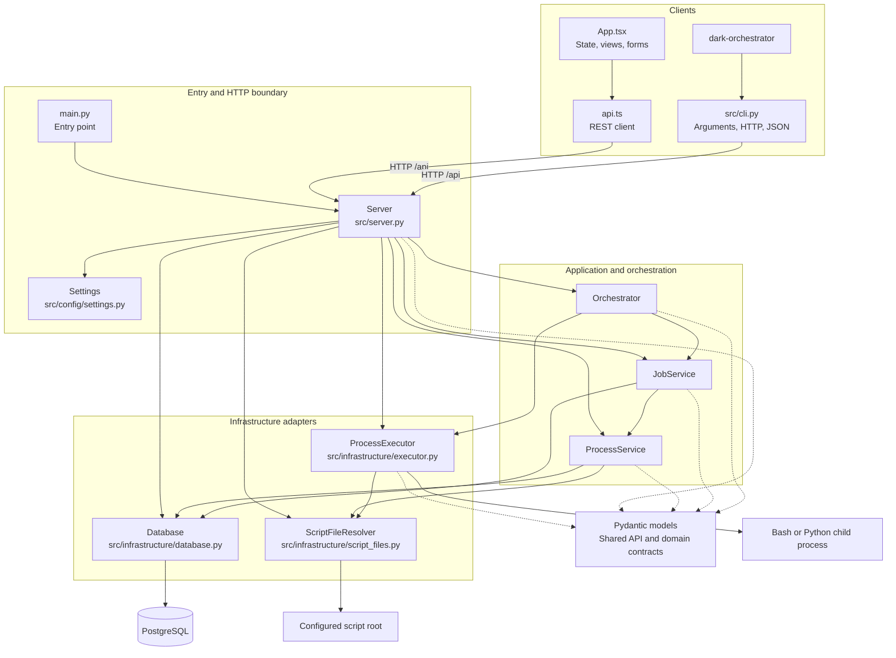

# Dark Orchestrator

Dark Orchestrator is a modular monolith that schedules, executes, and observes operational scripts.
Business behavior remains in Bash or Python processes, which may invoke AgentShell and interact with
Surely CRM.

## Code Architecture

`Server` is the composition root. It constructs the backend components and owns FastAPI routes and
application lifespan. The arrows below show the primary runtime dependencies after composition.

## Component Responsibilities

- `main.py` loads settings, creates the ASGI application, and starts Uvicorn.
- `dark-orchestrator` and `src/cli.py` provide the JSON-first REST CLI.
- `src/server.py` composes dependencies, owns lifespan, and exposes the REST API.
- `src/models/` contains shared Pydantic API and domain contracts.
- `ProcessService` manages process lifecycle and source persistence.
- `JobService` manages schedules, atomic claims, run history, and exceptions.
- `Orchestrator` owns scheduler state, heartbeats, concurrency, and execution tasks.
- `src/infrastructure/` contains the PostgreSQL, filesystem, and child-process boundaries.
- `ProcessExecutor` owns child processes, timeout, termination, and output capture.
- `Database` and `ScriptFileResolver` isolate PostgreSQL and filesystem concerns.
- `web/src/App.tsx` owns dashboard state; `web/src/api.ts` is the browser REST client.
- `tests/cli/` verifies the CLI end to end through a live API and isolated PostgreSQL database.

## Architectural Rules

- The REST API is the public application boundary.
- PostgreSQL is the durable source of orchestration state.
- Business and CRM behavior belongs in scripts, not application services.
- Job claiming stays transactional and uses PostgreSQL row locking.
- File sources remain beneath `SCRIPT_ROOT` and are never modified by Dark Orchestrator.
- Prefer the current direct design over speculative abstractions.

See the [test strategy](docs/test-strategy.md) for test boundaries, database isolation, and the
integration-first approach. Read this before adding any new tests, if any new tests you hope to 
implement do not align to existing test patterns **YOU MUST DISCUS WITH THE USER FIRST** and make
it clear why and how you will deviate from existing patterns and get their agreement before continuing.

See the [detailed architecture](docs/architecture/architecture.md) for lifecycle, persistence,
scheduling, execution, frontend, and deployment details. This should be updated following any work.
Significant decisions are recorded in the [ADR index](docs/architecture/adr/index.md), this should
be added to if significant work takes place.

