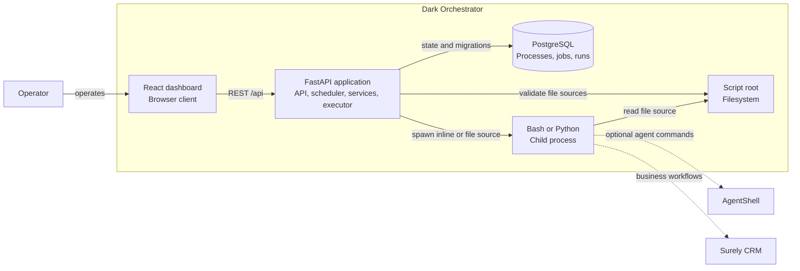

# DarK Orchestrator

Dark Business needs a reusable service that can schedule, execute, and observe operational scripts.
Those scripts may invoke [AgentShell](https://github.com/ScottRBK/agent-shell) and interact with
Surely CRM, but that business behavior does not belong inside the orchestrator.

## Architecture

- [ADRs](docs/architecture/adr/index.md) are used to track significant changes to the solution.
