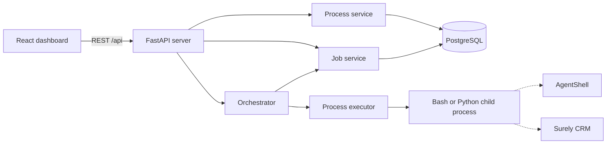
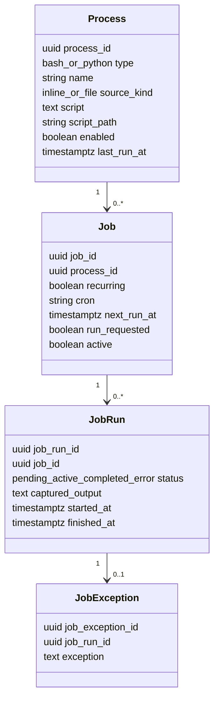

# ADR-001: Dark Orchestrator First Implementation

- **Status:** Accepted
- **Date:** 2026-07-13
- **Scope:** Implemented v1 baseline in this repository
- **Extended by:** [ADR-002](adr2_process_script_sources.md) and
  [ADR-003](adr3_command_line_client.md)

This ADR replaces the local architecture sketch copied from the Dark Business solution. It records
what Dark Orchestrator currently does. It does not commit the system to deferred features described
below.

## Context

Dark Business needs a reusable service that can schedule, execute, and observe operational scripts.
Those scripts may invoke [AgentShell](https://github.com/ScottRBK/agent-shell) and interact with
Surely CRM, but that business behavior does not belong inside the orchestrator.

The original sketch established these boundaries:

- use a client/server architecture;
- expose an API used by clients;
- persist orchestration state in PostgreSQL;
- represent work as Bash or Python processes;
- schedule one-off and recurring jobs;
- capture execution history and failures; and
- keep agents behind ordinary scripts so the agent harness and model remain replaceable.

The first implementation also needed safe concurrent dispatch, restart persistence, bounded process
execution, and a browser interface suitable for operating the service.

## Decision

### Runtime architecture

Dark Orchestrator is one FastAPI application containing the REST API, scheduler, services, and child
process executor. PostgreSQL is the durable source of truth. The production React application is
built as static assets and served by FastAPI.

The scheduler runs in the API process. There is no separate worker service, message broker, or task
queue in this implementation.

### Service boundaries

- `Server` owns FastAPI configuration, application lifespan, routes, and service composition.
- `ProcessService` owns process persistence and lifecycle operations.
- `JobService` owns schedules, transactional claims, run history, and exceptions.
- `Orchestrator` owns scheduler state, heartbeats, wake-ups, and execution concurrency.
- `ProcessExecutor` owns child-process creation, output capture, timeout, and termination.
- `Database` owns PostgreSQL connections and ordered SQL migrations.

Services use asynchronous Psycopg and explicit SQL. An ORM was not introduced because the domain is
small and job claiming requires deliberate PostgreSQL locking behavior.

### Persistence model

PostgreSQL contains four domain tables:

All entities use UUID identifiers. Domain timestamps are stored as `TIMESTAMPTZ` and API datetimes
must contain a timezone. Supplied datetimes are normalized to UTC.

Foreign keys deliberately preserve history:

- a process cannot be deleted while a job references it;
- a job cannot be deleted after it has run; and
- each failed run may have one persisted exception.

`created_by` and `modified_by` are currently stored as `system` because v1 has no authenticated user
identity.

Migrations are ordered SQL files applied during application startup. A PostgreSQL advisory lock
ensures concurrent application instances cannot apply the same migration simultaneously.

### Process script source

A process has one discriminated source:

- an inline script stored in PostgreSQL and editable through Dark Orchestrator; or
- a file path relative to the configured script root and managed outside Dark
  Orchestrator.

Bash and Python inline sources execute with `-c`. File sources are passed to the selected
interpreter after their resolved path is validated. AgentShell is not linked as an application
library; a process invokes its command-line interface when agent behavior is required.

[ADR-002](adr2_process_script_sources.md) defines source ownership, path security, execution, and
migration behavior. Run history does not yet snapshot source content or a source revision.

### Scheduling and claiming

A job references one process and is either:

- a one-off job that runs immediately by default or at a supplied `next_run_at`; or
- a recurring job with a strict five-field cron expression.

Cron schedules are evaluated in UTC. When a delayed recurring job is claimed, its next occurrence is
calculated from the claim time; v1 does not replay every missed occurrence. A run-now request is
persisted as a boolean independently from wall-clock schedule timestamps until it is claimed.

The orchestrator dispatches on a configurable heartbeat and can also be woken immediately after
relevant API changes. Dispatch is bounded by `MAX_CONCURRENT_JOBS`.

Due jobs are claimed in a PostgreSQL transaction using `FOR UPDATE OF j SKIP LOCKED`. The same
transaction:

1. clears any run-now request and advances or deactivates the job;
2. updates the process and job last-run timestamps; and
3. creates an active `JobRun`.

This prevents two application instances from claiming the same occurrence. A due job is excluded
while it already has a pending or active run, so runs of the same job do not overlap. A run-now
request made during an active run remains queued until that run finishes.

The schema allows a `pending` run state, but v1 claims directly into `active`. Execution tasks are
created only up to the available concurrency limit.

### Scheduler controls

The orchestrator has these states:

- `initialised`
- `starting`
- `running`
- `paused`
- `stopping`
- `stopped`

Application startup runs migrations and starts the scheduler. The controls have these semantics:

- **Pause** prevents new claims but lets current runs finish.
- **Start** begins or resumes dispatch.
- **Stop** prevents new claims, cancels current runs, and records those runs as errors.
- Disabling a process prevents future claims but does not cancel an already active run.

Scheduler state and concurrency limits belong to an individual application instance. PostgreSQL
claiming is safe across instances, but v1 is operated as a single scheduler because controls and
capacity are not cluster-wide.

### Process execution

Each execution starts a new POSIX process session. Standard error is merged into standard output and
both are captured as one ordered stream.

- Exit code zero produces a `completed` run.
- A non-zero exit code produces an `error` run and persisted exception text.
- Runtime is bounded by `PROCESS_TIMEOUT_SECONDS`.
- Captured output is bounded by `MAX_CAPTURED_OUTPUT_BYTES` and marked when truncated.
- Timeout, cancellation, and orchestrator shutdown kill the child process group rather than only the
  immediate child.
- Unexpected launch or execution failures are persisted against the run.

This execution model targets Linux, including WSL. It depends on POSIX process groups and is not a
native Windows process implementation.

### API and clients

The REST API is the public application boundary. It provides:

- service, database, and scheduler health;
- scheduler start, pause, and stop controls;
- process create, read, update, delete, enable, and disable operations;
- job create, read, update, delete, and run-now operations; and
- filtered, bounded run history with output and exception details.

FastAPI provides OpenAPI documentation at `/docs`.

The implemented client is a responsive React and TypeScript dashboard built with Vite. It provides
process management, scheduling, scheduler controls, summary metrics, run history, and captured
output. It polls the REST API; v1 does not use WebSockets or server-sent events.

The command-line client mentioned in the original architecture sketch is not part of v1.

### Configuration and deployment

Configuration uses Pydantic Settings with the `DARK_ORCH_` environment prefix. The principal
runtime limits are heartbeat interval, maximum concurrent jobs, process timeout, maximum captured
output, and the filesystem script root.

Local development uses PostgreSQL 18 in Docker Compose. Development, backend-test, and browser-test
databases are isolated from one another. The PostgreSQL host port and application bind to loopback
by default.

The API intentionally has no authentication or authorization in v1. It executes arbitrary code by
design and must not be exposed to an untrusted network. It should run as an unprivileged operating
system user.

### Validation strategy

Behavior is tested through agreed public boundaries rather than implementation mocks:

- FastAPI integration tests use real PostgreSQL;
- execution tests run harmless real Bash and Python children;
- concurrency tests use multiple real orchestrators and database claims;
- persistence tests recreate the application against retained database state; and
- Playwright drives the React dashboard against the real API in Chromium.

External operating-system and browser boundaries are exercised directly in the test environment.

## Consequences

### Benefits

- Business workflows remain independent from orchestration infrastructure.
- AgentShell usage does not couple the service to one agent harness or model.
- PostgreSQL provides durable state and atomic dispatch without another infrastructure component.
- One deployable application contains both the API and browser client.
- Bounded runtime, output, and concurrency prevent ordinary scripts from exhausting the service.
- Run output and failures are visible through both the API and dashboard.

### Trade-offs and known limits

- Processes may reference inline PostgreSQL content or files beneath one configured script root.
- Editing inline content or changing a referenced file affects subsequent runs of every related job.
- Run history stores output and failure details but not an immutable source snapshot or checksum.
- A hard application or host failure after a claim can leave an active run without lease-based
  recovery. Graceful shutdown is handled, but distributed run ownership is not.
- Scheduler controls and concurrency limits are instance-local rather than cluster-wide.
- Cron schedules are UTC-only and do not have a per-job timezone.
- Standard output and standard error are intentionally merged.
- There is no authentication, authorization, user attribution, or CLI client.
- Native Windows child-process execution is not supported.

These limits are explicit v1 boundaries rather than implied future behavior.

## Deferred decisions

The following changes require separate design decisions instead of silently extending this ADR:

1. Immutable source revision or checksum capture for each run.
2. Authentication, authorization, and real user attribution.
3. Worker leases and stale-run recovery after abrupt failures.
4. Cluster-wide scheduler controls and concurrency.
5. A command-line client for the REST API.
