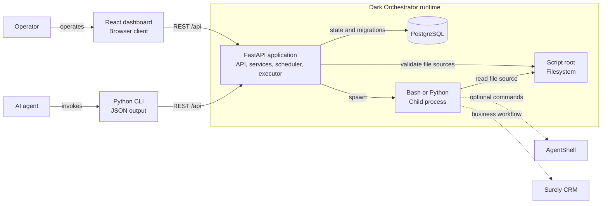
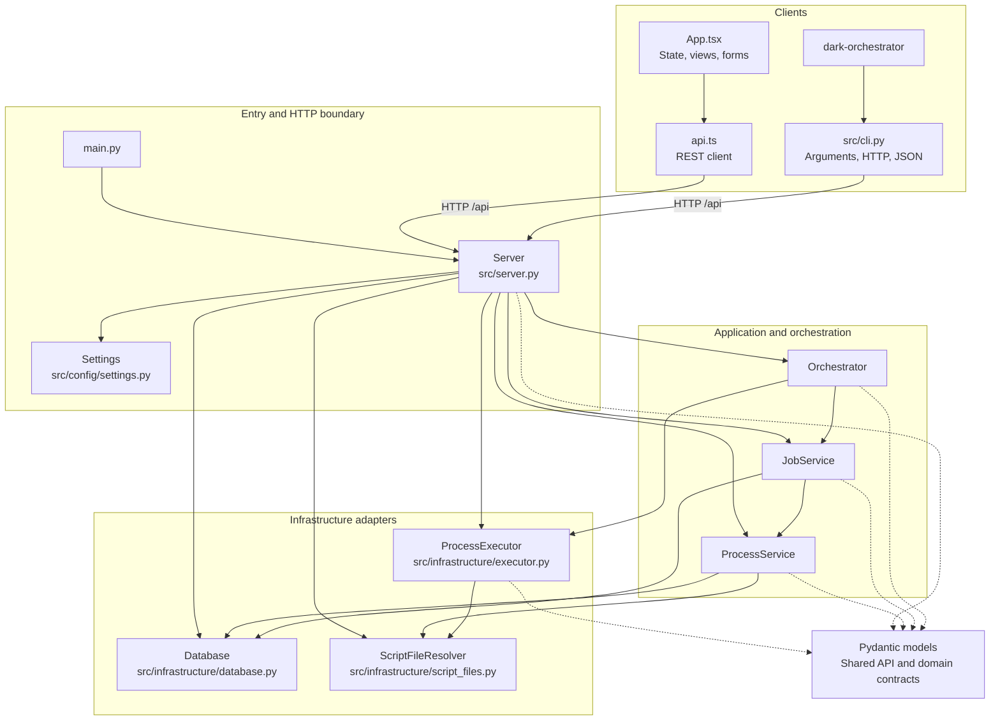
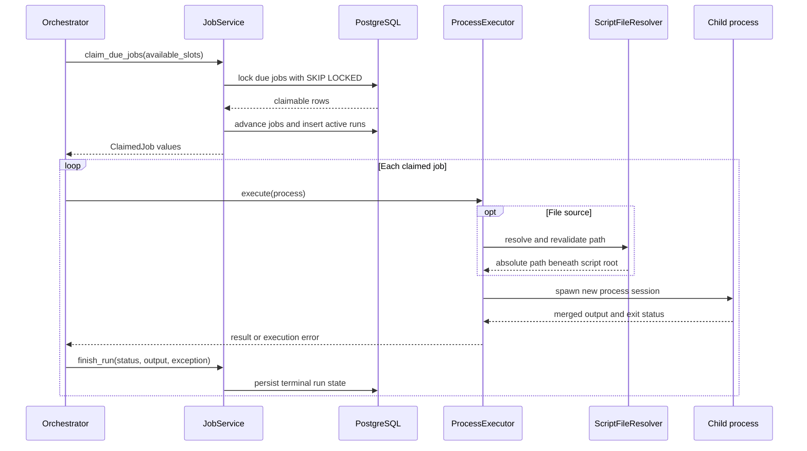
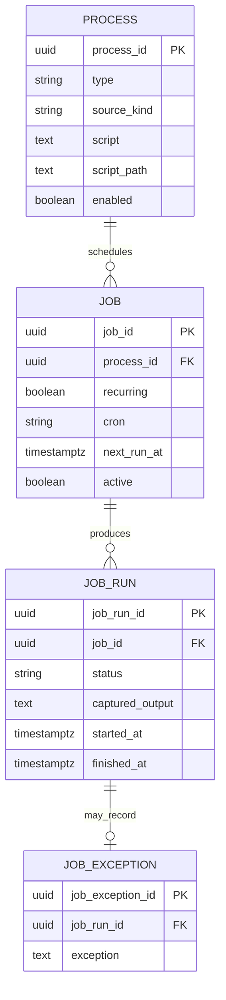

# Dark Orchestrator Architecture

This document describes the current code and runtime architecture. ADRs explain why significant
decisions were made; this document explains how the implemented parts fit together today.

## Architectural Style

Dark Orchestrator is a pragmatic modular monolith:

- one FastAPI process contains the REST API, application services, scheduler, and executor;
- PostgreSQL is the durable state store;
- a React application and Python CLI use the REST API;
- FastAPI serves the React application in production;
- Bash and Python child processes perform scheduled work; and
- business behavior, AgentShell commands, and Surely CRM interaction remain inside scripts.

The backend follows a simple layered direction without enforcing strict Clean Architecture. Services
use concrete infrastructure adapters directly, and Pydantic models are shared between the API and
internal code. This keeps the implementation easy to understand while the domain remains small.

## Repository Map

```text
main.py                         Server application entry point
dark-orchestrator               CLI executable
src/cli.py                     CLI parsing, REST requests, and JSON output
src/config/settings.py         Environment-backed server configuration
src/server.py                  Composition root, lifespan, routes, SPA serving
src/models/                    Shared API and domain models
src/services/process_service.py Process lifecycle and source persistence
src/services/job_service.py    Scheduling, claiming, runs, and exceptions
src/services/orchestrator.py   Scheduler loop and execution concurrency
src/infrastructure/database.py Psycopg connections and migration runner
src/infrastructure/executor.py Child-process execution boundary
src/infrastructure/script_files.py Filesystem source security boundary
src/migrations/                Ordered PostgreSQL migrations
web/src/App.tsx                Dashboard state, views, and forms
web/src/api.ts                 Typed REST client
web/src/types.ts               Frontend API contracts
tests/                         HTTP integration and execution tests
cli_tests/                     CLI subprocess and HTTP-contract tests
web/tests/                     Playwright browser tests
```

## Runtime Context

The React dashboard runs in the operator's browser. The Python CLI runs in a shell and is suitable
for agent automation. Both clients use the same REST API. FastAPI serves the dashboard's production
assets, owns the scheduler, and launches child processes. Those scripts may use external systems,
but the orchestrator does not import their business logic.



The scheduler is embedded in the API process. There is no separate worker service, broker, or task
queue.

## Code Component Dependencies

`Server` constructs all backend dependencies. The diagram shows their primary collaboration after
composition rather than every import.



## Composition and Application Lifecycle

`main.py` creates the ASGI application from the global settings object. `Server` is the composition
root and creates these objects once for that application instance:

1. `Database`
2. `ScriptFileResolver`
3. `ProcessService`
4. `JobService`
5. `ProcessExecutor`
6. `Orchestrator`

There is no dependency-injection framework. Constructor wiring keeps ownership explicit.

FastAPI lifespan controls startup and shutdown:

1. apply pending PostgreSQL migrations under an advisory lock;
2. start the orchestrator heartbeat;
3. accept API requests; and
4. stop the orchestrator and cancel active execution tasks during shutdown.

If a frontend build exists, FastAPI serves it with an `index.html` fallback. Otherwise the root
route returns basic service information.

## HTTP Boundary

`src/server.py` owns route registration and translates HTTP operations into service calls. Routes do
not contain scheduling or persistence logic.

Pydantic performs request parsing and structural validation. Application exceptions are translated
at the boundary:

- `NotFoundError` becomes HTTP `404`;
- `ConflictError` becomes HTTP `409`; and
- `InvalidProcessSourceError` becomes HTTP `422`.

The main route groups are:

- health and scheduler status;
- scheduler start, pause, and stop controls;
- process lifecycle and enablement;
- job lifecycle and run-now requests; and
- bounded run-history queries.

The REST API is the public application seam used by the dashboard, CLI, and backend integration
tests. The CLI has no privileged in-process path around this boundary.

## Shared Models

`src/models/` contains both API contracts and internal values. The code deliberately does not create
separate request DTOs, domain entities, and persistence entities for the same small structures.

The principal models are:

- `Process`, with a Python or Bash type and discriminated source;
- `Job`, which references a process and describes one-off or recurring scheduling;
- `JobRun`, which records execution state and output; and
- `JobException`, which records one failure description for a run.

Process sources form a discriminated union:

```text
ProcessSource
├── InlineProcessSource { kind: "inline", content: string }
└── FileProcessSource   { kind: "file", path: relative string }
```

The same nested source shape crosses the API and is used by services and the executor. Persistence
flattens it into constrained PostgreSQL columns.

## Process Service

`ProcessService` owns process lifecycle behavior:

- create, retrieve, list, update, and delete processes;
- enable and disable execution eligibility;
- flatten source models into database columns;
- hydrate process models from database rows; and
- validate file sources during creation or source updates.

Deletion relies on PostgreSQL foreign keys. A process referenced by a job produces a conflict rather
than deleting its schedule or history implicitly.

For file sources, the service delegates path validation to `ScriptFileResolver`. It does not read or
write the file content.

## Job Service

`JobService` owns schedule and run persistence:

- verify a process when creating a job;
- calculate initial and recurring run times;
- list, retrieve, update, run, and delete jobs;
- transactionally claim due work;
- create and finish run records; and
- retrieve run history and exceptions.

It depends on `ProcessService` when a job is created. For job and run reads, it uses joined SQL and
hydrates the nested process directly. This avoids additional queries but duplicates a small amount
of process-row mapping from `ProcessService`.

Cron expressions contain exactly five fields and are evaluated in UTC. A delayed recurring job moves
to its next occurrence from claim time; missed occurrences are not replayed individually.

## Scheduler and Execution Flow

`Orchestrator` owns only in-memory control state:

- current scheduler status;
- heartbeat task;
- active execution tasks;
- wake event; and
- per-instance concurrency accounting.

Durable jobs and runs remain in PostgreSQL. The heartbeat runs at a configured interval, but
relevant API changes and completed tasks wake it immediately.



### Atomic claiming

`JobService.claim_due_jobs()` performs the claim in one PostgreSQL transaction:

1. select due jobs for enabled processes;
2. exclude jobs that already have pending or active runs;
3. lock selected job rows with `FOR UPDATE OF j SKIP LOCKED`;
4. advance a recurring job or deactivate a one-off job;
5. update process and job last-run timestamps; and
6. insert an active `JobRun`.

Execution begins only after that transaction commits. Multiple application instances cannot claim
the same occurrence, and one job cannot overlap itself.

### Concurrency and controls

`MAX_CONCURRENT_JOBS` limits execution tasks in one application instance. When a task finishes, its
callback removes it from the active set and wakes the scheduler so the free slot can be filled.

Control semantics are:

- **Pause:** stop claiming new work while active runs continue.
- **Start:** start or resume claiming.
- **Stop:** stop claiming, cancel active tasks, kill their process groups, and record errors.
- **Disable process:** prevent future claims without cancelling an active run.

Controls and concurrency are instance-local. PostgreSQL claims are safe across instances, but v1
does not provide cluster-wide pause, stop, or capacity controls.

## Process Execution Boundary

`ProcessExecutor` translates a process model into an operating-system command.

### Inline sources

- Bash: `/usr/bin/env bash -c <content>`
- Python: the current Python interpreter with `-c <content>`

### File sources

- Bash: `/usr/bin/env bash <resolved-path>`
- Python: the current Python interpreter with `<resolved-path>`
- Working directory: configured script root

Every child starts in a new POSIX process session. Standard error is merged into standard output so
captured text preserves one observable stream.

The executor:

- enforces `PROCESS_TIMEOUT_SECONDS`;
- captures at most `MAX_CAPTURED_OUTPUT_BYTES`;
- marks truncated output;
- treats exit code zero as success;
- returns non-zero exit codes as failures; and
- kills the complete process group on timeout or cancellation.

The operating-system boundary targets Linux, including WSL. It is not a native Windows execution
implementation.

## Filesystem Boundary

`ScriptFileResolver` is shared by `ProcessService` and `ProcessExecutor`.

A file source must:

1. use a relative path;
2. contain no parent-directory traversal;
3. resolve beneath `SCRIPT_ROOT` after following symbolic links;
4. resolve to a regular file; and
5. be readable by the orchestrator user.

Validation occurs when a file source is created or changed and immediately before every execution.
The dashboard changes only the stored path; it never modifies external file content.

Every application instance must see equivalent files beneath its configured root. Container
deployments should mount that root read-only where possible.

## Persistence Architecture

`Database` uses asynchronous Psycopg and explicit SQL. Each service operation opens a connection and
uses its connection context as the transaction boundary. There is no connection pool or repository
abstraction in v1.

Direct SQL is intentional for the small data model and explicit locking requirements. Migrations are
ordered SQL files recorded in `schema_migrations`. A PostgreSQL advisory lock serializes migration
application across server instances.



A database constraint requires exactly one process source representation:

| Source | `source_kind` | `script` | `script_path` |
|---|---|---|---|
| Inline | `inline` | Content | `NULL` |
| File | `file` | `NULL` | Relative path |

Foreign keys preserve history:

- a process cannot be deleted while jobs reference it;
- a job cannot be deleted after runs reference it; and
- a run may have at most one exception row.

## Frontend Architecture

The frontend is intentionally dependency-light:

- `App.tsx` owns dashboard data, selected view, dialogs, drawers, and action state;
- `api.ts` owns typed `fetch` calls and error translation;
- `types.ts` mirrors REST response and request contracts;
- `Icon.tsx` provides the local icon set; and
- `styles.css` contains the visual system and responsive layout.

`App.tsx` polls health, processes, jobs, and runs together every 750 milliseconds. Mutations call
one API operation and then refresh the complete dashboard state. There is no client router,
global state library, WebSocket channel, or component framework.

During development, Vite serves the frontend and proxies `/api` to FastAPI. In production, FastAPI
serves the built assets and handles the same-origin REST requests.

## CLI Architecture

The repository-root `dark-orchestrator` executable delegates to `src/cli.py`. The CLI uses argparse,
`urllib`, and JSON from the Python standard library. It does not import server models or services.

The command hierarchy covers health, scheduler controls, process management, job management, and run
history. `--url` overrides `DARK_ORCH_API_URL`, which overrides the loopback default. Successful
response bodies are emitted as JSON on standard output. HTTP, network, and malformed-response errors
are emitted as JSON on standard error with a non-zero exit status.

Process `--file` values refer to paths beneath the server's `SCRIPT_ROOT`; they are not client-side
uploads. This preserves the source ownership and filesystem boundary established by ADR-002.

The executable is currently distributed from a source checkout and can be symlinked onto `PATH`.
The project was not converted into a Python distribution solely to expose a console entry point.
ADR-003 records the client contract and the deferred packaging decision.

## Configuration and Deployment

`Settings` uses the `DARK_ORCH_` environment prefix and supports `.env`. Important operational
settings include:

- PostgreSQL URL;
- heartbeat interval;
- per-instance concurrency;
- process timeout;
- captured-output limit;
- filesystem script root;
- CORS origins; and
- frontend build directory.

Local development runs PostgreSQL in Docker Compose and runs the Python application directly in WSL
or Linux. Development, integration-test, and browser-test databases are isolated.

The API and PostgreSQL host port bind to loopback by default. The API has no authentication or
authorization and must not be exposed to an untrusted network. Process scripts are privileged code,
and the service should run as an unprivileged operating-system user.

## Failure and Recovery Boundaries

Graceful cancellation is handled: active child process groups are killed and their runs become
errors. Output, timeout, non-zero exits, and launch failures are persisted.

An abrupt application or host failure after a database claim may leave an active run without an
owner. V1 has no worker lease or stale-run recovery. Run history also records output and exception
text but not an immutable source snapshot or checksum.

These limits matter before treating the scheduler as a distributed worker cluster.

## Validation Architecture

Tests exercise public behavior rather than internal call graphs:

- FastAPI tests use the HTTP API and real PostgreSQL;
- CLI tests invoke the executable against a deterministic local HTTP server;
- execution tests launch harmless real Bash and Python processes;
- source tests use real files and filesystem permissions;
- concurrency tests use real database claims and orchestrator instances;
- migration tests start from the previous schema and verify through the API; and
- Playwright drives the React dashboard against the real API in Chromium.

Mocks are reserved for external systems that cannot be run locally. AgentShell and Surely CRM are
not required for orchestrator integration tests because harmless scripts exercise the execution
boundary.

CLI contract tests deliberately stop at the HTTP boundary and require neither FastAPI nor
PostgreSQL. A full-stack CLI integration suite is deferred to a separate slice rather than using a
long-lived database implicitly.

## Current Design Pressure Points

The current direct structure is appropriate for the implemented scope. These areas should be
reconsidered only when a real extension creates pressure:

- `src/server.py` combines composition, lifespan, route registration, and static serving.
- `JobService` combines job management, transactional claiming, and run persistence.
- `App.tsx` contains most frontend components and state.
- Process-row hydration is duplicated between `ProcessService` and joined `JobService` queries.
- API models and internal domain models are intentionally the same types.

Do not extract routers, repositories, interfaces, workers, or frontend state layers solely to make
the architecture appear more formal. Raise the boundary with the user when a feature genuinely
needs it.

## Related Documentation

- [ADR index](adr/index.md)
- [ADR-001: First implementation](adr/adr1_dark_orchestrator.md)
- [ADR-002: Process script sources](adr/adr2_process_script_sources.md)
- [ADR-003: Command-line REST client](adr/adr3_command_line_client.md)
- [Dependency audit](../dependency-audit.md)
- [Project README](../../README.md)
